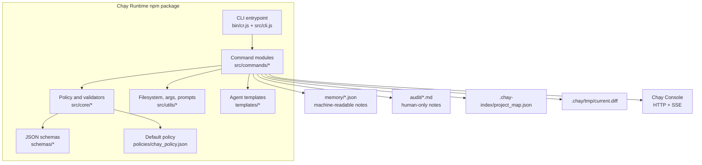
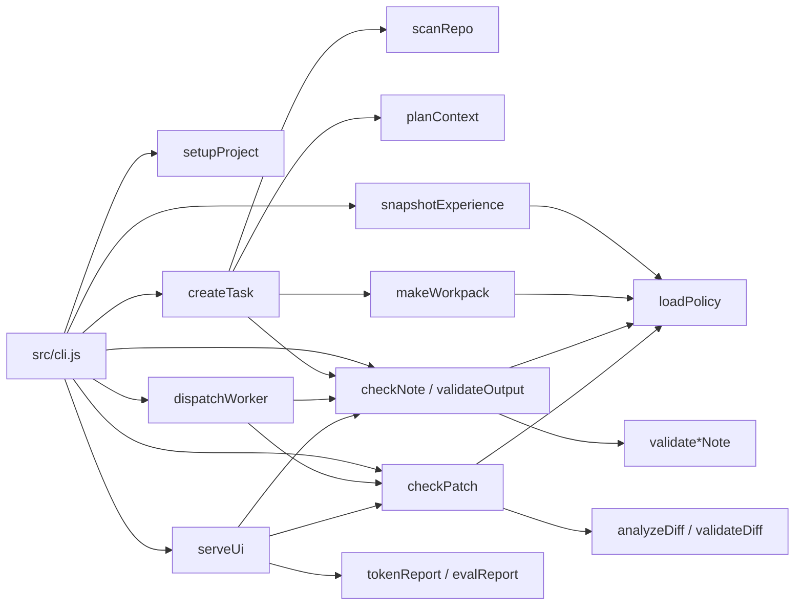
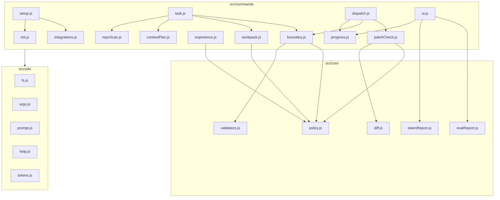

# Chạy Runtime C4 Model

This document describes the current Chạy Runtime architecture using the C4 model.

## Scope

Chạy Runtime is a local, note-based policy boundary for multi-agent coding CLIs. It prepares compact context, creates bounded work notes, validates worker outputs, checks patch scope, and exposes a sanitized realtime console for humans.

## C1: System Context

```mermaid
flowchart LR
  Human["Human developer"]
  Repo["Target project repo"]
  Claude["Claude Code CLI"]
  Codex["Codex CLI"]
  Antigravity["Antigravity"]
  Console["Chạy Console"]
  Chạy Runtime["Chạy Runtime CLI"]

  Human -->|"runs setup/task/ui commands"| Chạy Runtime
  Chạy Runtime -->|"scans files, writes notes, checks patches"| Repo
  Chạy Runtime -->|"installs controller/worker instructions"| Claude
  Chạy Runtime -->|"writes bounded worker notes"| Codex
  Chạy Runtime -->|"writes bounded worker notes"| Antigravity
  Console -->|"reads sanitized HTTP/SSE state"| Chạy Runtime
```

### External Actors

- Human developer: starts tasks, reviews notes, and commits approved changes.
- Claude Code, Codex, and Antigravity: supported coding agents that can be selected as main/controller or bounded worker roles in `cr setup`. The packaged controller integration is currently most complete for Claude Code; Codex and Antigravity ship as bounded worker instruction/template integrations.
- Chạy Console: local realtime workflow UI served by Chạy Runtime.
- Target project repo: the codebase being worked on.

## C2: Containers



### Container Responsibilities

- CLI entrypoint: parses the top-level command and dispatches to command modules.
- Command modules: implement user-facing workflows such as setup, task creation, repo scan, context planning, workpack creation, realtime UI, dispatch, and patch checks.
- Core modules: enforce policies, validate note schemas, analyze diffs, and build token/eval reports.
- Templates and schemas: provide installable agent instructions and output contracts.
- Runtime files: store compact JSON notes, human-only audit notes, repo indexes, and scoped diffs.
- Chạy Console: local UI with `/api/state`, `/api/stream`, `/api/action`, `/api/progress`, and `/api/chat`.

## C3: Components



### Main Workflows

- Setup: creates Chạy Runtime folders, installs integration files, and writes `memory/host_config.json`.
- Task creation: scans the repo, plans a compact context package, generates a work note, and validates it.
- Worker execution: `cr dispatch <worker>` runs a configured worker engine, writes progress notes, validates result notes with a retry cap, and checks patch scope.
- Output validation: validates result notes against schema and returns compact retry instructions when invalid.
- Patch validation: refreshes a scoped git diff and rejects out-of-scope or forbidden changes.
- Reporting: computes token and quality reports from local runtime files.

## C4: Code-Level Modules



## Runtime Data Model

- `memory/host_config.json`: enabled agents, main controller, workers, models, skills, and runtime folders.
- `memory/task_note.json`: compact task intent and constraints.
- `memory/context_package.json`: selected files and repo context for the worker.
- `memory/plan_ledger.json`: runtime-owned task continuity ledger, written only after dispatch validation and patch checks pass.
- `memory/experience_spectrum.json`: inspectable memory/skills/rules compression snapshot.
- `memory/<worker>_work_note.json`: bounded worker contract, allowed files, architecture rules, and output schema.
- `memory/<worker>_progress.json`: live workflow step and short status message.
- `memory/<worker>_result_note.json`: compact worker result note.
- `.chay-index/project_map.json`: generated repo file map.
- `.chay/tmp/current.diff`: generated scoped diff used by patch checks.

## Realtime Behavior

The native Chạy Console is the realtime surface:

- `cr ui serve --port 7770` serves `/api/stream` using Server-Sent Events.
- `site/console.html` contains the Console UI; `src/commands/ui.js` serves the static shell and exposes the local JSON/SSE APIs.
- The UI opens an `EventSource` connection and re-renders when events arrive.
- The server watches `memory` and `.chay/tmp` with `fs.watch` and broadcasts fresh state after note/diff changes.
- A 10-second fallback poll keeps the UI updated if a filesystem event is missed.

## Package Boundary

Chạy Runtime intentionally keeps the boundary local and file-based:

- Agents consume compact JSON notes instead of raw logs or full audit markdown.
- Humans can inspect Markdown audit files.
- The realtime UI hides raw logs, diffs, prompts, stack traces, and audit markdown.
- Patch checks validate changed files and forbidden patterns against the work note and policy.
